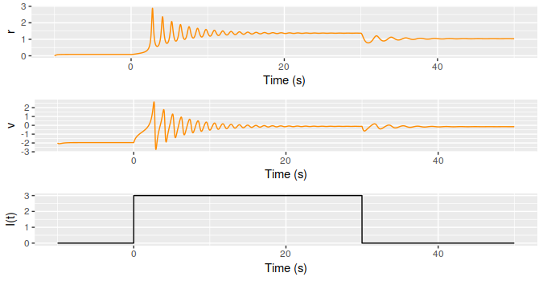
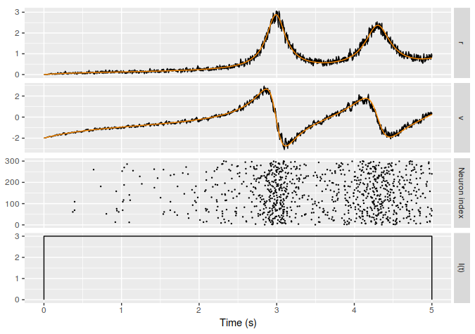

# FREs and QIF neurons simulations
This is code simulates the dynamics of neuronal ensembles using the model of FREs and QIF neurons.

## FREs (macroscopic model)
The macroscopic dynamics of neuronal ensembles are studied using the the firing-rate equations (FREs). The equations and model descriptions can be found in [1].

The current code, `fre_ode_solve.R`, plots the firing rate, $r$, the mean membrane potential, $v$, and the applied current, $I(t)$:

## QIF (microscopic model)
The quadratic integrate-and-fire (QIF) neurons is the canonical model for class I neurons, and, thus, generically describes
their dynamics near the spiking threshold. Our aim here is to derive the FREs corresponding to a heterogeneous all-to-all coupled population of $N$ QIF neurons.

The current code, `qif_solve_cpp_from_file.R` (which uses precompiled QIF neurons using C++), plots the mean membrane potential $v$ (FREs), as well as the instantaneous membrane potential (QIF neurons).

## References

[1]: Montbrió, E., Pazó, D., & Roxin, A. (2015). *Macroscopic description for networks of spiking neurons*. Physical Review X,: 5(2), 1–14. https://doi.org/10.1103/PhysRevX.5.021028
